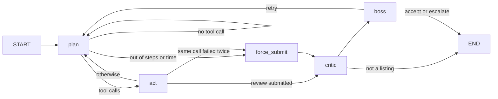

# 0026. The agent as a LangGraph graph, its state checkpointed in Postgres

- **Status**: Accepted
- **Date**: 2026-09-25
- **Issue**: #41 (part of #3)

## Context

The agent of [ADR 0024](0024-agent-loop-and-tools.md) and the actor-critic-boss of [ADR 0025](0025-actor-critic-boss.md) run as hand-written Python: a `for` inside a `while`, with its state in local variables. The session on orchestration puts the line where a framework starts to pay: several steps, cycles and branches, and state that has to outlive a process. The human pause of #42 is that last one: a run that waits for a person must still be there after a restart, or it is a timeout with extra steps.

## Decision

**The same flow as a `StateGraph`** (`app/domain/graph/`), selected with `AGENT_ORCHESTRATOR=graph` (the default). The hand-written loop stays in the repository, tested, behind `AGENT_ORCHESTRATOR=loop`: it is what the graph is measured against, and a test runs both on the same scripted answers and asserts they return the same review.

- **Typed state with reducers.** Messages, trace, usage and fragments accumulate through reducers, so a node returns only what it added; two nodes writing a plain list would race and the last would win (the "state clobbering" of the multi-agent session).
- **The state is plain JSON.** LangGraph can serialise our dataclasses and Pydantic models, but reading them back means importing classes named in a database row; its next versions block that by default, and it is a risk anyway. Nodes convert at their edges: typed objects in the code, JSON in the checkpoint.
- **Every exit is a condition on the state**, and the loop's hard exits are kept as they were: iterations, time, and the same call failing twice all route to a forced submission. The graph's recursion limit is a backstop above what those allow, never the thing that stops a run.
- **Errors**: a tool failure is an observation, as in the loop; a provider outage (`LLMUnavailable`) escapes the graph and the API answers 503, because an outage is not a review outcome.

### The checkpointer

- **Postgres, the database the corpus already lives in**: no new service. A run's `thread_id` is its `run_id`.
- **LangGraph owns its checkpoint tables** (`setup()`, with its own list of applied migrations); Alembic owns the corpus. Copying the library's DDL into an Alembic migration would pin the service to today's schema and break silently on the next upgrade: the library owning its tables is the lesser coupling. The saver is built on the first run, not at start-up, so a database that is not ready yet fails a run, not the service.
- **Retention: a finished run leaves nothing behind.** The checkpoint holds the listing's text, and [ADR 0018](0018-data-privacy-and-providers.md) says the service keeps no listings, so the thread is deleted as soon as the review is returned (the trace goes back in the response). Only a run paused for a person (#42) stays, because it has to.

### What the graph does differently: the retry

When the boss sends the actor back, the loop starts a fresh run with the rejections in the prompt. The graph **continues the same conversation**: the actor keeps the fragments it already read and hears why its findings were rejected. It knows more, and it pays for it: every later turn re-reads the whole conversation.

## Checked on the real models

One review through the graph on the local Postgres (Madrid, the listing with three violations; GPT-5.4 mini for the actor and the critic while Anthropic is at its monthly limit):

- The critic rejected the correct fee finding on the first pass, the boss sent the actor back, and the second pass came out with **the three violations correctly cited** (RD 390/2021 art. 15, LAU art. 36 and art. 20), accepted.
- **Nothing was left** in the checkpoint tables afterwards.
- **$0.054 and 61,729 input tokens**, against ~$0.016 for a review without a retry: the price of a retry that carries its whole conversation.

## Consequences

- A review run is now a row that exists while it runs and can wait: #42 adds the pause, #43 the permissions on its tools.
- The graph's cost on a retry is the argument for the loop's fresh start, and the other way round is its knowledge. Which one is worth it, and how often the critic sends a correct finding back (it did here), is what #52 measures on the listings dataset.
- Two orchestrators to keep in step until then. The shared pieces (the toolbox, the submission parser, the critic, the boss) live in `app/generation/agentic/`, so only the wiring differs.
