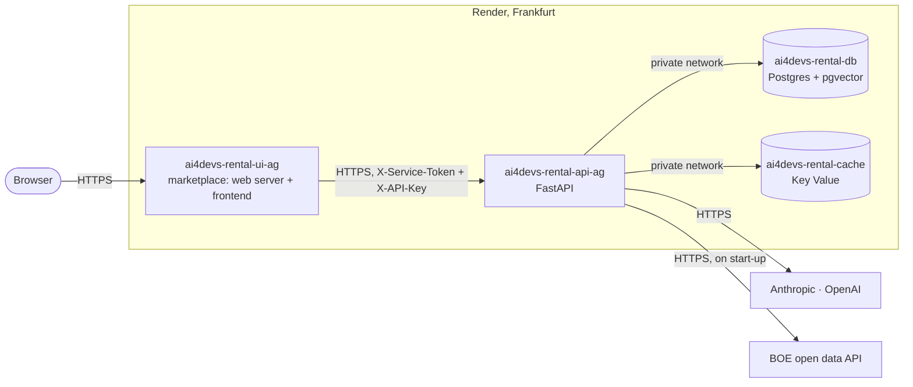

# Deployment

The system runs on Render's free tier, described as code in [`render.yaml`](../render.yaml). Every push to `main` redeploys it. Why Render, and what the free tier costs in design, is in [ADR 0021](decisions/0021-hosting-on-render.md).

## Topology



| Resource | Reachable from | Protected by |
|---|---|---|
| UI (the marketplace) | The internet: the product's front door | The pages are public (fictional listings); every tool call needs the shared login, and only the calls the frontend makes are forwarded to the API, with credentials the browser never sees ([ADR 0036](decisions/0036-marketplace-frontend.md)) |
| API | The internet, because free web services cannot receive private traffic | Service token, API key, rate limit, daily spend cap ([ADR 0020](decisions/0020-access-spend-and-probes.md)) |
| Postgres | The private network only (`ipAllowList: []`) | Not addressable from outside |
| Key Value | The private network only (`ipAllowList: []`) | Not addressable from outside |

## Environment variables

Names only; values live in Render and nowhere else.

| Variable | Service | Set by |
|---|---|---|
| `ENVIRONMENT=production` | API | Blueprint. Makes the API refuse to start with any required secret missing |
| `API_KEY`, `SERVICE_TOKEN` | API | Generated by Render |
| `API_KEY`, `SERVICE_TOKEN` | UI | Copied from the API by the Blueprint |
| `ANTHROPIC_API_KEY`, `OPENAI_API_KEY` | API | **Typed by the owner** when the Blueprint is created |
| `DATABASE_URL`, `REDIS_URL` | API | Wired by the Blueprint from the database and the Key Value instance |
| `BOOTSTRAP_CORPUS=true` | API | Blueprint. Rebuilds the corpus from the BOE on start-up |
| `DAILY_SPEND_CAP_USD` | API | Blueprint, `2.0` |
| `API_URL` | UI | Blueprint, the API's public address |
| `ENVIRONMENT=production` | UI | Blueprint. Makes the web server refuse every tool call without its login configured, and mark the session cookie `Secure` |
| `UI_USERNAME`, `UI_PASSWORD` | UI | **Typed by the owner** in the dashboard: the shared login ([ADR 0034](decisions/0034-shared-login-for-the-ui.md)) |
| `SESSION_SECRET` | UI | Generated by Render. Signs the session cookie; regenerating it signs everyone out |

## First deploy

The only manual step, done once by the owner of the repository:

1. Sign in at [dashboard.render.com](https://dashboard.render.com) with GitHub.
2. **New → Blueprint**, pick `AI4Devs-finalproject-AG`, branch `main`.
3. Fill `ANTHROPIC_API_KEY` and `OPENAI_API_KEY` when asked, and `UI_USERNAME` and `UI_PASSWORD` if asked too, and **Apply**.

If the Blueprint already exists (it was created before the login existed), set the login by hand: **ai4devs-rental-ui-ag → Environment → Add environment variable**, `UI_USERNAME` and `UI_PASSWORD`, **Save changes**. Render redeploys the UI with them. Until the three values (the two and `SESSION_SECRET`) are set, the marketplace in production shows its pages but refuses every tool with a "not configured" message, on purpose.

**From Streamlit to the marketplace (2026-09-27, #89).** The service `ai4devs-rental-ui-ag` keeps its name and its URL; on the next sync the Blueprint changes its command to the web server (`uvicorn web.main:app`), its health check to `/healthz` and adds `SESSION_SECRET`, generated by Render. `UI_USERNAME` and `UI_PASSWORD` stay as they were. If the Blueprint does not sync by itself, **Blueprints → the Blueprint → Manual sync**. Check afterwards that `SESSION_SECRET` exists under the service's **Environment**.

Use a long password (a passphrase of four or five words, or 20 random characters): the web server locks a client after five wrong attempts for a minute, but another address starts the count again. Send it to the evaluator through a one-time link, never in the repository or in clear in an email.

Render creates the four resources and builds the image. On its first start the API migrates the database, downloads the six BOE sources and embeds them (~1.5 s of ingestion, ~10 s and $0.02 of embeddings); later starts find nothing changed and skip both.

If Render had to rename a service because the name was taken, set the UI's `API_URL` to the API's actual address.

## Checking a deploy

```bash
API=https://ai4devs-rental-api-ag.onrender.com
curl $API/health                       # {"status":"ok"}
curl $API/ready                        # database, cache and budget
curl -o /dev/null -w '%{http_code}\n' $API/docs   # 200: Swagger UI, public on purpose
curl -X POST $API/api/v1/regulations/ask -d '{}'   # 401: no token

WEB=https://ai4devs-rental-ui-ag.onrender.com
curl $WEB/healthz                      # {"status":"ok"}: the web server, without calling the API
curl $WEB/bff/session                  # {"login_required":true,"signed_in":false}; 503 if the login is not configured
curl -X POST $WEB/api/v1/regulations/ask -H 'Content-Type: application/json' -d '{"question":"x"}'   # 401: no session
curl -X POST $WEB/api/v1/regulations/search -d '{}'   # 404: not a call the marketplace makes
```

Then, in the marketplace: ask a question from a listing's assistant (it asks for the shared login first, and comes back to the listing), check a listing on `/publicar`, send it to publish, and, if the agent pauses it, decide it on `/moderacion`.

## Rollback

Render keeps every deploy. **Service → Events → the previous deploy → Rollback** redeploys that exact build in about a minute, without rebuilding. Do it on the API and the UI together if both changed. The UI cannot be rolled back to a Streamlit build as is: the service's command is the web server's now, and those images have none. Going back to Streamlit means restoring its command and health check in `render.yaml` first. A rollback does not undo a migration: the migrations of this project only add, so an older build runs against a newer schema, but a destructive migration would need a `downgrade` first.

Rolling back the code does not roll back the configuration: environment variables stay as they are.

## Backups

- **The corpus is derived data.** It is rebuilt from the BOE on every start of an empty database. Losing it costs one restart, a few seconds and $0.02 of embeddings. That is why the free database, which Render deletes 30 days after creation and does not back up, is acceptable here.
- **What would be lost**: the state that only the service has, which from #3 onwards means paused agent runs waiting for a person and the feedback of #51. On the free plan that is accepted and documented. On a paid database, Render's point-in-time recovery covers it; a manual `pg_dump` before a risky change is the minimum otherwise, and a backup counts only once a restore has been tried.

## Secret rotation

Add the new value, deploy, check, then revoke the old one: in that order, so there is never a moment with neither.

- **Provider keys**: create the new key at the provider, set it in the API service, let it redeploy, check `/ready` and one review, then revoke the old key.
- **`API_KEY` and `SERVICE_TOKEN`**: regenerate in the API service; the UI reads them from the API through the Blueprint, so redeploy both.

No secret is in the repository, the image or the CI pipeline: CI only runs tests and scans the history for leaked secrets (gitleaks).

## Cost limits

- **Hosting**: $0. Four free resources.
- **Models**: at most `DAILY_SPEND_CAP_USD` per day ($2 by default, ~350 reviews or ~120 regulation answers). At the cap the API answers 503 until midnight UTC instead of spending.
- **Provider consoles**: a monthly limit on each provider account, as the last line.

## Known operational limitations

- **Cold starts.** Free services sleep after 15 minutes without traffic. The first visit wakes the web server; the first tool call wakes the API, up to a minute each. The marketplace asks the API as soon as a tool is on screen, and says so while it waits.
- **One instance each.** A deploy has a few seconds of unavailability, and a restart of the API loses the requests still in flight when the platform's default shutdown window runs out (the free tier does not allow a longer one).
- **The API is public**, behind its token and key, because free services cannot receive private traffic. On a paid plan it would sit on the private network with only the marketplace's web server in front.
- **The database expires** 30 days after creation. Recreating it is a Blueprint sync; the corpus rebuilds itself.
- **Spend is global.** Behind the marketplace every visitor shares one key, so the rate limit and the spend cap are shared by all visitors of the demo.
